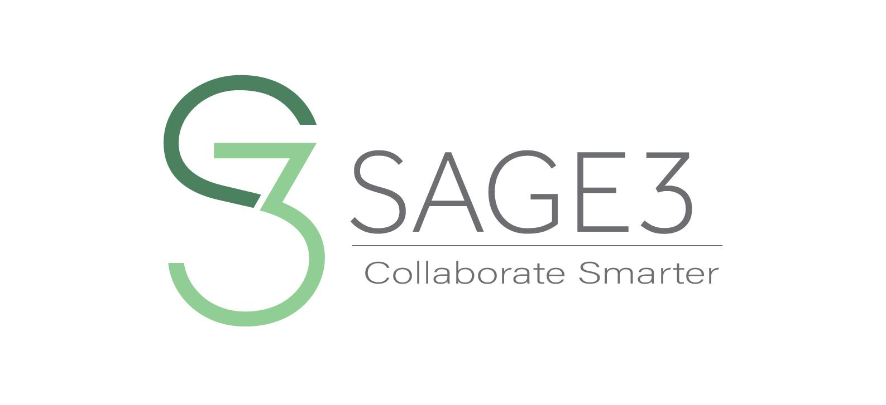

I designed the logo for the SAGE 3 collaborative software system, which is developed by students and researchers at the Laboratory for Advanced Visualization and Applications.

You can learn more at the [UH LAVA Lab Website](https://sage3.sagecommons.org/).
